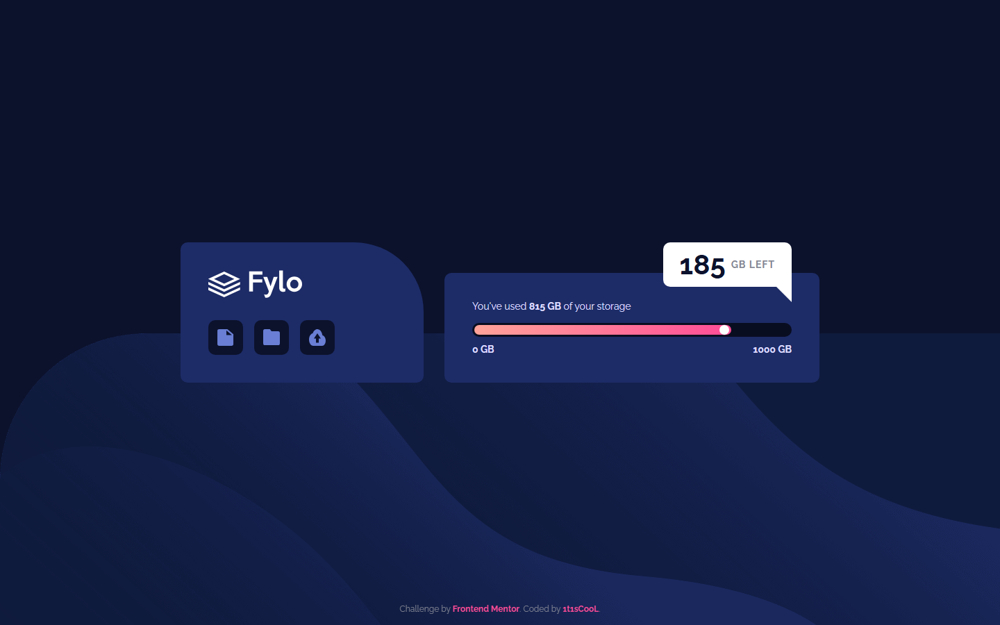

# Frontend Mentor - Fylo data storage component solution

This is a solution to the [Fylo data storage component challenge on Frontend Mentor](https://www.frontendmentor.io/challenges/fylo-data-storage-component-1dZPRbV5n). Frontend Mentor challenges help you improve your coding skills by building realistic projects.

## Table of contents

- [Overview](#overview)
    - [The challenge](#the-challenge)
    - [Screenshot](#screenshot)
    - [Links](#links)
- [My process](#my-process)
    - [Built with](#built-with)
- [Author](#author)

## Overview

### The challenge

Users should be able to:

- View the optimal layout for the component depending on their device's screen size
- See the storage meter fill up and the remaining space count up on page load
- (Bonus) Experience reduced motion when `prefers-reduced-motion` is enabled

### Screenshot

### Links

- Solution URL: [Vercel](https://fylo-data-storage-component-xi-eight.vercel.app/)
- Live Site URL: [mmalabugin.ru/FyloDataStorageComponent](https://mmalabugin.ru/FyloDataStorageComponent)

## My process

### Built with

- Semantic HTML5 markup
- CSS custom properties
- Flexbox
- SCSS
- CSS keyframe animations (animated meter fill, count-up, pulsing handle)
- [Angular](https://angular.dev/) 20 - standalone component with signals

## Author

- Website - [mmalabugin.ru](https://mmalabugin.ru/)
- Frontend Mentor - [@1t1sCooL](https://www.frontendmentor.io/profile/1t1sCooL)
- Twitter - [@vi_el_mar](https://www.twitter.com/vi_el_mar)
- Telegram - [@ItIsCooL](https://t.me/ItIsCooL)
